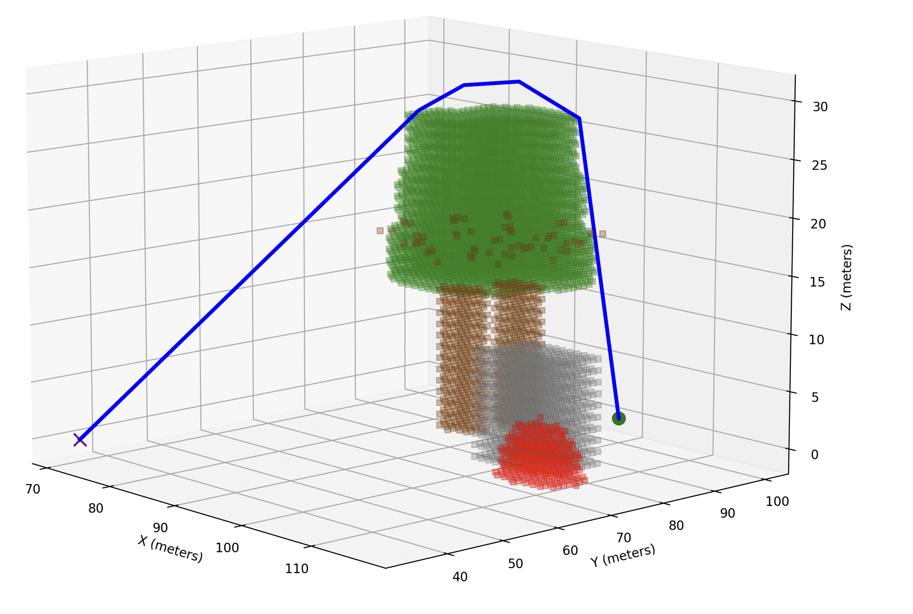
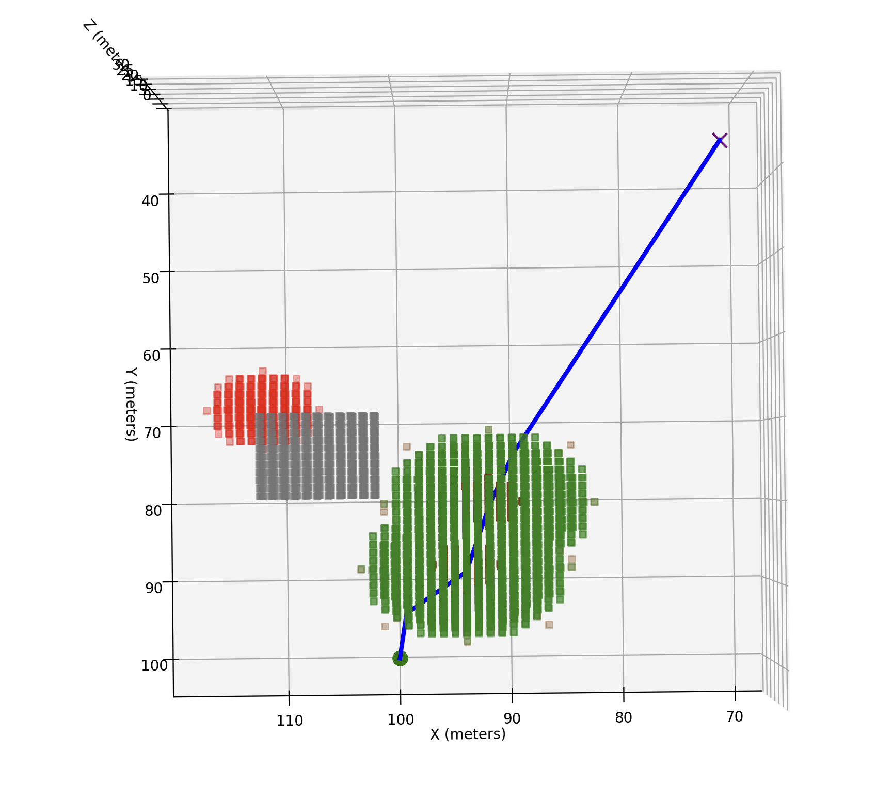
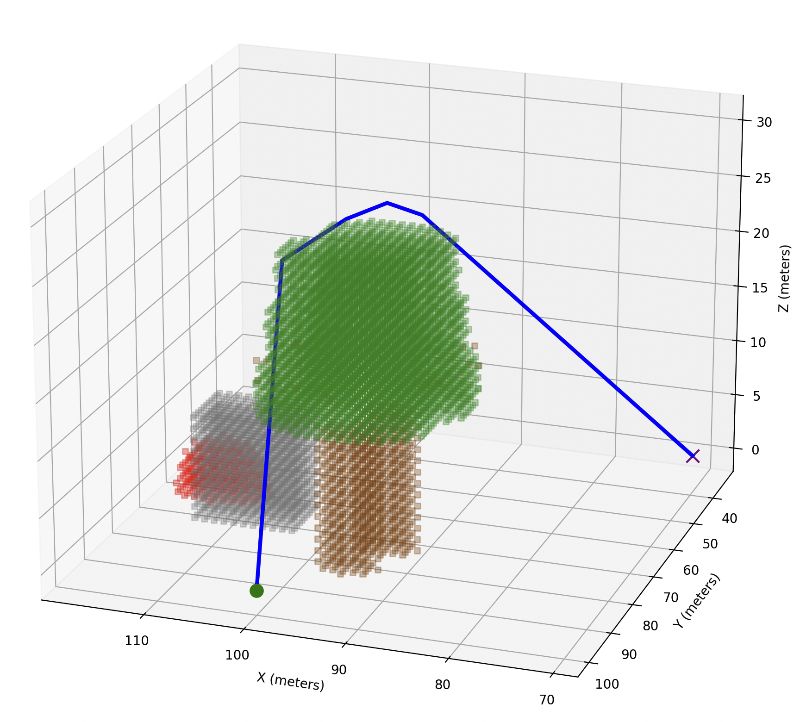
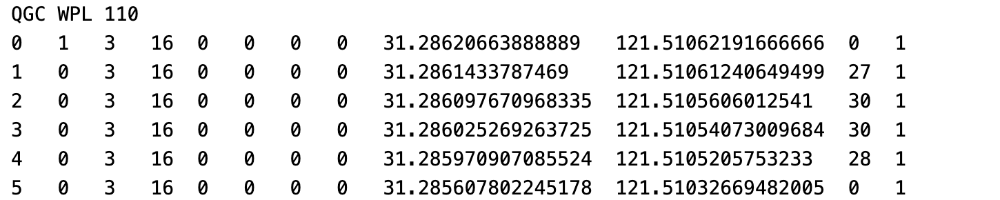

# 3D A* Path Planning and Visualization Tool

## 项目简介
本项目实现了一个三维路径规划和可视化工具，基于A\*算法进行三维环境下的路径规划，适用于无人机、自动驾驶等需要进行三维导航的场景。  
该项目包括路径规划、地理坐标与本地坐标转换、障碍物建模和路径可视化等核心功能。

## 功能特点
- **三维A\*路径规划**  
  支持复杂三维环境，能够考虑26个方向的邻居节点，进行路径搜索。
  
- **障碍物建模**  
  支持树形、立方体和球形等多种障碍物类型的添加。
  
- **地理坐标与UTM坐标转换**  
  实现地理坐标（经纬度）与本地坐标的相互转换。
  
- **路径平滑**  
  提供路径平滑功能，通过线性插值减少路径中的冗余节点。
  
- **可视化**  
  实现三维网格障碍物和路径的实时可视化，直观展示规划结果。

## 依赖环境
本项目基于Python 3.x，并需要以下库：
- `numpy` – 数值计算
- `matplotlib` – 数据可视化
- `pyproj` – 地理坐标转换
- `heapq` – 优先队列处理

安装依赖：
```bash
pip install numpy matplotlib pyproj
```
具体环境信息请查看文件 [requirement.txt](requirement.txt)，也可以直接使用以下命令安装依赖：
```
pip install -r requirements.txt
```
## 使用方法
### 运行主程序
确保所有依赖库已安装后，在命令行中运行：
```
python A*.py
```
主要功能：

读取地理坐标障碍物

生成三维网格

进行A*路径规划

路径平滑处理

可视化规划路径和障碍物分布

生成航点文件

### 修改障碍物与路径点
在 main() 函数中，可以自由定义障碍物和必须经过的途径点：
```
# 定义障碍物列表
obstacles = [
    Obstacle(
        lat=31 + 17/60 + 9.9474/3600,  # 31°17'9.9474"N
        lon=121 + 30/60 + 38.0247/3600,  # 121°30'38.0247"E
        alt=0,
        trunk_radius=3,
        trunk_height=15,
        obstacle_type='tree'
    ),
    Obstacle(
        lat=31 + 17/60 + 9.5/3600,  # 31°17'9.5"N
        lon=121 + 30/60 + 38.5/3600,  # 121°30'38.5"E
        alt=0,
        trunk_radius=5,  # 半边长
        trunk_height=10,
        obstacle_type='cube'
    ),
    Obstacle(
        lat=31 + 17/60 + 9.3/3600,  # 31°17'9.3"N
        lon=121 + 30/60 + 38.7/3600,  # 121°30'38.7"E
        alt=0,
        trunk_radius=5,
        trunk_height=10,
        obstacle_type='sphere'
    ),
]
```
障碍物类型：tree、cube、sphere
添加障碍物：通过实例化 Obstacle 类并添加到 obstacles 列表中。

### 定义必须经过的途径点
```
must_pass_geo = [
    {
        'lat': 31 + 17/60 + 9.9474/3600,  # 31°17'9.9474"N
        'lon': 121 + 30/60 + 38.0247/3600,  # 121°30'38.0247"E
        'alt': 30  # 高度30米
    },
    {
        'lat': 31 + 17/60 + 9.6815/3600,  # 31°17'9.6815"N
        'lon': 121 + 30/60 + 37.9426/3600,  # 121°30'37.9426"E
        'alt': 30  # 高度30米
    }
]
```

### 参数配置
在主程序中，可以调整以下参数以适应不同环境：
```
# 定义Home位置的地理坐标（起点）
home_geo = {
    'lat': 31 + 17/60 + 10.3439/3600,  # 31°17'10.3439"N
    'lon': 121 + 30/60 + 38.2389/3600,  # 121°30'38.2389"E
    'alt': 0  # 起始高度（米）
}

# 定义网格大小和分辨率
grid_size_x = 200  # 米
grid_size_y = 200  # 米
grid_size_z = 100  # 米
grid_resolution = 1  # 每个网格单元代表1米
```
Home位置：设定起点的地理坐标。

### 注意事项

起点和终点：起点和终点不应位于障碍物上，若位于障碍物上程序会直接报错并退出。
 
网格分辨率：网格分辨率影响路径规划的精度，分辨率越高，计算量越大，规划时间越长。
 
坐标范围：确保所有坐标在定义的网格范围内，避免坐标转换后超出网格边界。

## 实例结果



航点文件示意图

# LICENSE
本项目采用 MIT License 许可证。详情请参阅 LICENSE 文件。

